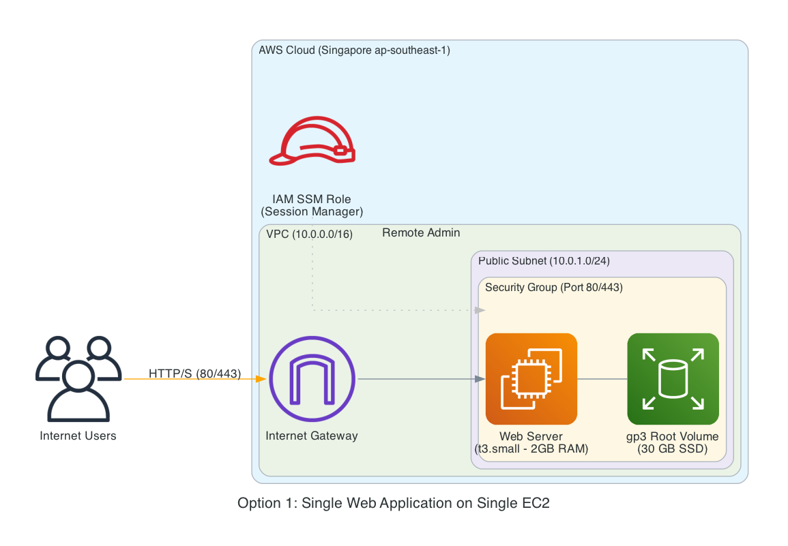

# Option 1: Single Web Application on Single EC2

Hạ tầng và Mã nguồn ứng dụng hoàn chỉnh cho **Option 1: Single Web Application on Single EC2**.

## 1. Cấu trúc thư mục chuẩn (File Structure)
```text
.
├── .github/workflows/ci-cd.yml   # CI/CD Pipeline (test code, lint CloudFormation, auto-deploy)
├── app/                          # Mã nguồn Website độc lập (Node.js/Express)
│   ├── package.json
│   ├── server.js
│   └── README.md
├── infra/                        # Mã nguồn CloudFormation hạ tầng AWS
│   ├── cloudformation.yaml       # Template CloudFormation độc lập
│   └── architecture_diagram.png  # Sơ đồ kiến trúc Diagram-as-Code
├── test/                         # Kiểm thử tự động (Unit test API & app)
│   └── test_api.js
└── README.md                     # Báo cáo kỹ thuật và chi phí Infracost
```

## 2. Báo cáo Chi phí Hạ tầng (Infracost & AWS Pricing Calculator - Region Singapore)
| Thành phần | Đơn giá AWS (Singapore) | Số lượng/tháng | Thành tiền hàng tháng |
| :--- | :--- | :--- | :--- |
| **EC2 t3.small** | $0.0208 / giờ | 730 giờ | **$15.18** |
| **Public IPv4 Address** | $0.0050 / giờ | 730 giờ | **$3.65** |
| **EBS gp3 Storage (30GB)**| $0.0800 / GB | 30 GB | **$2.40** |
| **EBS Snapshots Backup** | $0.0500 / GB | 15 GB | **$0.75** |
| **TỔNG CHI PHÍ THÁNG** | | | **$21.98 / tháng (~555.000 VNĐ)** |

## 3. Kiến trúc Hạ tầng (Architecture Diagram)


## 4. Quy trình CI/CD & Branching Strategy
- **dev**: Nhánh phát triển chính (Default development branch). Mọi commit và Pull Request được kiểm tra tự động qua GitHub Actions (`Test Application & Lint Infra`).
- **main**: Nhánh Production được bảo vệ (**Branch Protection Rule**). Chỉ cho phép merge từ nhánh **dev** sau khi toàn bộ bài test passed.
- **Auto-deployment**: Khi có thay đổi trong `app/` hoặc `infra/` được merge vào `main`, pipeline tự động đồng bộ hạ tầng và cập nhật code web mới nhất lên EC2 instance.
