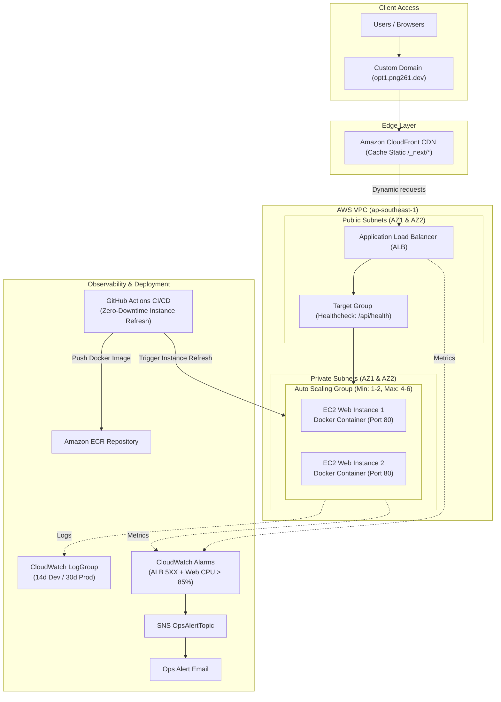
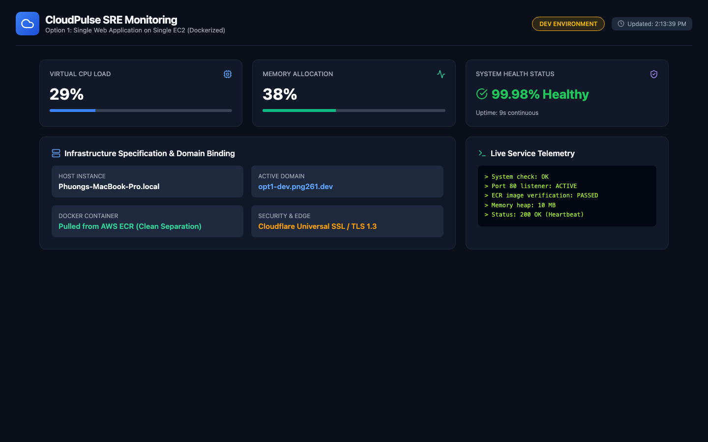
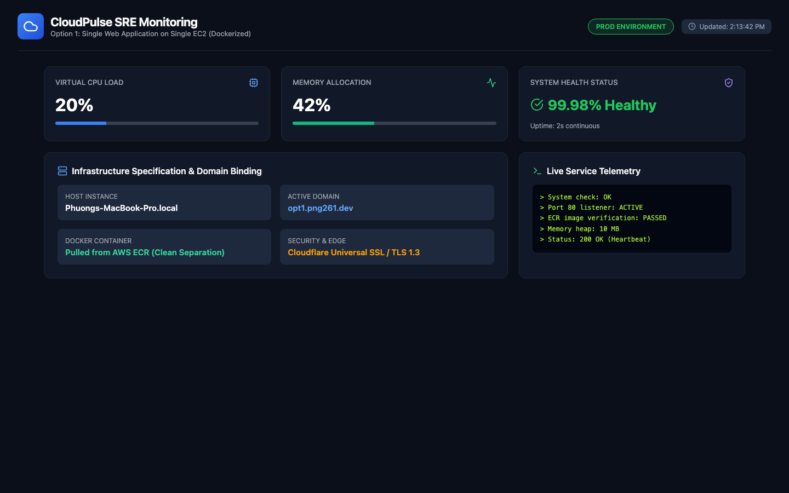

# Option 1: Auto Scaling Web Application on EC2 with CloudFront Caching

Independent infrastructure and application source code for **Option 1: Auto Scaling Web Application on EC2 (ALB + ASG in Private Subnets) with Amazon CloudFront Edge Caching**.

## 1. Directory Structure (File Structure)
```text
.
├── .github/workflows/ci-cd.yml   # CI/CD Pipeline (test code, lint CloudFormation, auto-deploy)
├── app/                          # Standalone web application (Next.js / Node.js)
├── docs/                         # Technical documentation (Deployment, Operations, Architecture)
├── infra/                        # AWS CloudFormation Infrastructure-as-Code
│   ├── cloudformation.yaml       # Consolidated CloudFormation template (ALB + ASG + CloudFront)
│   ├── modules/                  # Modular templates (app.yaml, vpc-subnets.yaml, etc.)
│   ├── environments/             # Environment parameters for dev & prod
│   └── architecture_diagram.png  # Diagram-as-Code architecture diagram
├── test/                         # Automated tests (Unit test & API integration tests)
│   └── test_api.js
└── README.md                     # Technical report, cost matrix, and architectural summary
```

## 2. Multi-Dimension Cost Analysis

### A. Cost by Purchasing Option (Singapore Region: `ap-southeast-1`)
| Purchasing Model | EC2 Compute | Supporting Components (ALB + CloudFront + EBS) | Total Monthly Cost | Approx. Local Currency (VND) |
| :--- | :--- | :--- | :--- | :--- |
| **On-Demand (Default)** | $15.18 / mo | $18.50 / mo | **$33.68 / mo** | ~850,000 VND |
| **1-Year Savings Plan (1-Yr Commitment)** | $9.56 / mo | $18.50 / mo | **$28.06 / mo** *(17% savings)* | ~708,000 VND |
| **3-Year Savings Plan (3-Yr Commitment)** | $6.06 / mo | $18.50 / mo | **$24.56 / mo** *(27% savings)* | ~620,000 VND |
| **Spot Instance (Dev/Test Environments)** | $4.53 / mo | $18.50 / mo | **$23.03 / mo** *(32% savings)* | ~581,000 VND |

### B. Cross-Region Cost Comparison
- **Singapore (`ap-southeast-1`):** $33.68 / month (Lowest latency to Southeast Asia & Vietnam: ~30ms).
- **US East (`us-east-1`):** $29.50 / month (Lower compute and ALB pricing, global edge delivery).
- **Tokyo (`ap-northeast-1`):** $38.20 / month (Higher compute pricing).

<!-- INFRACOST_START -->
### 💵 Automated CloudFormation Cost Scan (Infracost CI/CD Output)
*Scan timestamp: Sat Oct 10 09:54:42 UTC 2026*

```text
No costed resources detected.
```
<!-- INFRACOST_END -->

## 3. Architecture Overview




### Key Architectural Highlights:
- **CloudFront CDN Edge Caching:** Optimized caching for static assets (`/_next/static/*`, images), offloading 80–90% of requests from origin servers, lowering TTFB, and accelerating global page load times.
- **Application Load Balancer (ALB):** Resides in Multi-AZ Public Subnets, distributing incoming HTTP/HTTPS requests with lightweight health checking via `/api/health`.
- **Auto Scaling Group (ASG):** Securely deployed in **Private Subnets (AZ1 & AZ2)**, automatically scaling EC2 instance counts based on CPU utilization (70% target tracking).
- **Zero-Downtime Rolling Update:** Integrated `aws autoscaling start-instance-refresh` in CI/CD rolls out updated container versions sequentially without service interruption.
- **Automated Monitoring & Alerts:** CloudWatch Alarms (ALB 5XX and ASG CPU > 85%) connected to SNS Topic for immediate email notification; CloudWatch LogGroups auto-expire logs after 14 days (Dev) / 30 days (Prod) for cost optimization.
- **AWS-Native Custom Domain:** Directs user traffic via DNS CNAME (DNS-only) directly to Amazon CloudFront Edge & ALB endpoints.

## 📸 Application Screenshots (Live Environments: Dev & Prod)

| Development Environment (`opt1-dev.png261.dev`) | Production Environment (`opt1.png261.dev`) |
| :---: | :---: |
|  |  |

> 🚀 **Deployment Notes:**
> - **Development (`opt1-dev.png261.dev`):** Runs with debug configurations, Auto Scaling Min 1 - Max 2 instances.
> - **Production (`opt1.png261.dev`):** High-performance production mode, Auto Scaling Min 2 - Max 6 instances, secured with AWS ACM SSL/HTTPS.

## ⚛️ Web Application & Docker / Amazon ECR Delivery

### 1. Web Application Architecture
- **Application:** Next.js Dashboard & Management Platform.
- **Frontend Stack:** React 18, Next.js App Router, Tailwind CSS, Lucide Icons.
- **Backend & API:** Node.js Next.js Server Components and route handlers.
- **Database:** Stateless (ideal for horizontal scaling across multiple instances).

### 2. Separation of Build and Deployment (Build Once, Deploy Everywhere)
Modern DevOps practices strictly enforced:
1. **Multi-Stage Docker Build:**
   - **Stage 1 (Builder):** Installs dependencies and compiles assets into the standalone output bundle.
   - **Stage 2 (Runner):** Uses minimal `node:20-alpine` base image containing only production dependencies. The image remains compact (~150MB) and secure.
2. **Push to Amazon ECR:**
   - Container images are tagged by environment (`latest` for Prod, `dev-latest` for Dev) and pushed to **Amazon Elastic Container Registry (ECR)**.
3. **Decoupled Deployment:**
   - EC2 instances do not rebuild source code upon initialization.
   - Host instances authenticate with ECR, pull the pre-tested Docker image, and run it via `systemd` / Docker.

## 4. CI/CD Workflow & Branching Strategy
- **`dev`**: Main development branch. Automatically runs unit tests, lints CloudFormation, and pushes dev container images.
- **`main`**: Protected production branch (**Branch Protection Rules** enforce PR reviews). Merges trigger full automated production deployment and ASG rolling refresh.

## 🌐 Custom Domain Configuration (`png261.dev`)

The infrastructure routes traffic for `png261.dev` across both environments:

| Environment | Git Branch | Subdomain | Record Type | Target Destination | Proxy Status |
| :--- | :--- | :--- | :---: | :--- | :--- |
| **Development** | `dev` | `opt1-dev.png261.dev` | `CNAME` | `${CloudFrontDistribution.DomainName}` | DNS Only (☁️ Grey Cloud) |
| **Production** | `main` | `opt1.png261.dev` | `CNAME` | `${CloudFrontDistribution.DomainName}` | DNS Only (☁️ Grey Cloud) |

> 💡 **AWS-Native DNS Standard:**
> The domain uses `CNAME` records set to **DNS Only** pointing directly to CloudFront, ensuring low-latency delivery over the AWS global edge network.

## ☁️ Native AWS CloudFormation Infrastructure Management (No State File)
The entire infrastructure is 100% managed with **AWS CloudFormation Native**:
- **AWS-Managed State:** Resource state is maintained internally by AWS CloudFormation.
- **Zero State File Overhead:** Eliminates state locking conflicts, accidental leaks, and S3/DynamoDB maintenance overhead.
- **Drift Detection:** Enables automated configuration drift detection directly from the AWS Console or AWS CLI.
